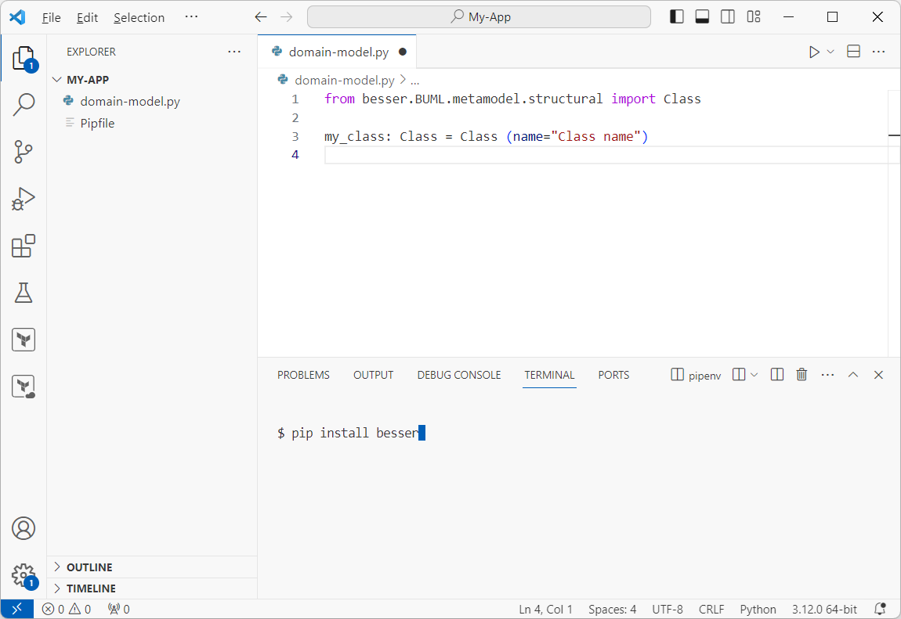

Installation
=============

Basic Installation
--------------------------------
BESSER works with Python 3.10+. We recommend creating a virtual environment (e.g. `venv <https://docs.python.org/3/tutorial/venv.html>`_, 
`conda <https://docs.conda.io/en/latest/>`_).

The latest stable version of BESSER is available in the Python Package Index (PyPi) and can be installed using

.. code-block:: console

    $ pip install besser

BESSER can be used with any of the popular IDEs for Python development such as `VScode <https://code.visualstudio.com/>`_,
`PyCharm <https://www.jetbrains.com/pycharm/>`_, `Sublime Text <https://www.sublimetext.com/>`_, etc.

Running BESSER Locally
----------------------
If you are interested in developing new code generators or designing BESSER extensions, you can download and modify the full codebase, 
including tests and examples.

**Step 1: Clone the repository**

.. code-block:: console

    $ git clone https://github.com/BESSER-PEARL/BESSER.git
    $ cd BESSER

**Step 2: Create a virtual environment**

Run the setup script to create a virtual environment (if not already created), install the requirements, and configure the ``PYTHONPATH``. 
This ensures compatibility with IDEs (like VSCode) that may not automatically set the ``PYTHONPATH`` for recognizing *besser* as an importable module.

.. code-block:: console

    $ python setup_environment.py

.. note::
  
  Each time you start your IDE, run the `setup_environment.py` script to ensure the environment is properly configured.

**Step 3: Run an example**

To verify the setup, you can run a basic example.

.. code-block:: console

    $ cd tests/BUML/metamodel/structural/library
    $ python library.py
