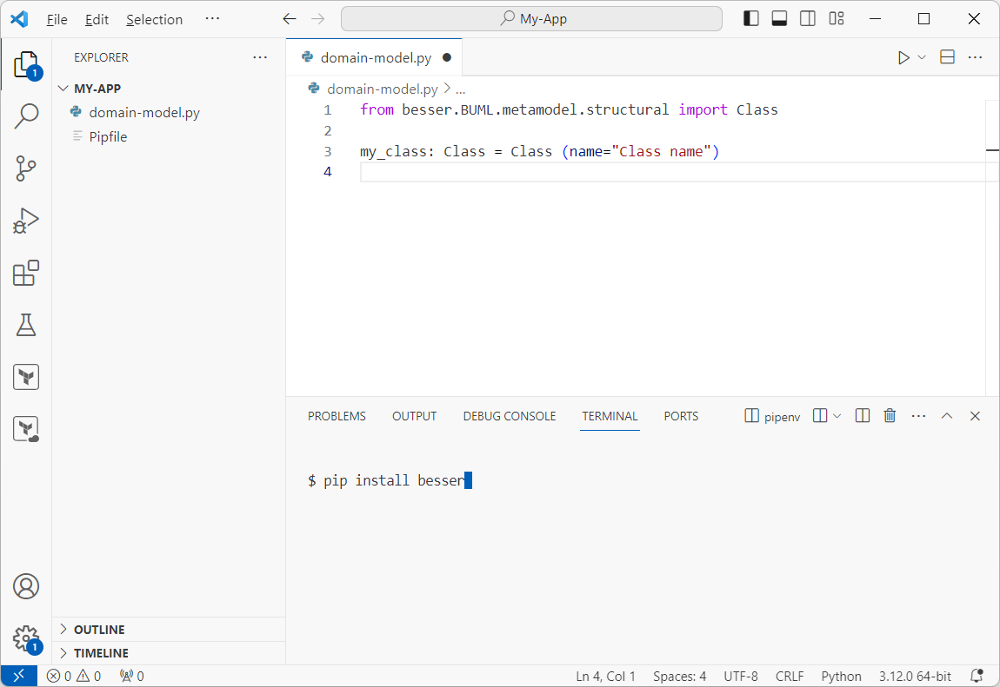

Installation
=============

Basic Installation
--------------------------------
BESSER requires Python **3.11** or later, and is tested on **3.11** and **3.12**. We recommend creating a virtual environment (e.g. `venv <https://docs.python.org/3/tutorial/venv.html>`_,
`conda <https://docs.conda.io/en/latest/>`_).

.. warning::
   Python 3.13 is not tested yet because some dependencies have not released compatible wheels. Please use Python 3.11 or 3.12 for now.

The latest stable version of BESSER is available in the Python Package Index (PyPi) and can be installed using

.. code-block:: console

    $ pip install besser

BESSER can be used with any of the popular IDEs for Python development such as `VScode <https://code.visualstudio.com/>`_,
`PyCharm <https://www.jetbrains.com/pycharm/>`_, `Sublime Text <https://www.sublimetext.com/>`_, etc.

Running BESSER Locally
----------------------
If you are interested in developing new code generators or designing BESSER extensions, you can download and modify the full codebase, 
including tests and examples.

**Step 1: Clone the repository**

.. code-block:: console

    $ git clone https://github.com/BESSER-PEARL/BESSER.git
    $ cd BESSER

**Step 2: Create a virtual environment**

Create a virtual environment, activate it, and install BESSER in editable mode.
Installing with ``pip install -e .`` (rather than only the requirements file) is
what makes *besser* importable from anywhere, including in IDEs like VSCode that
do not set ``PYTHONPATH`` for you.

On Windows:

.. code-block:: console

    $ python -m venv venv
    $ venv\Scripts\activate
    $ pip install -e .

On Linux / macOS:

.. code-block:: console

    $ python -m venv venv
    $ source venv/bin/activate
    $ pip install -e .

.. note::
   To run the web modeling editor's backend as well, install its extra
   dependencies (FastAPI and friends are not in the root requirements file)::

      $ pip install -r besser/utilities/web_modeling_editor/backend/requirements.txt

   Optional extras are also available: ``pip install besser[nn]`` for the
   neural-network generators and ``pip install besser[agents]`` for the agent
   personalization features.

.. note::
  
  Each time you start your IDE, activate the virtual environment to ensure the environment is properly configured.

**Step 3: Run an example**

To verify the setup, you can run a basic example.

.. code-block:: console

    $ cd tests/BUML/metamodel/structural/library
    $ python library.py

For common installation issues, see :doc:`troubleshooting`.
