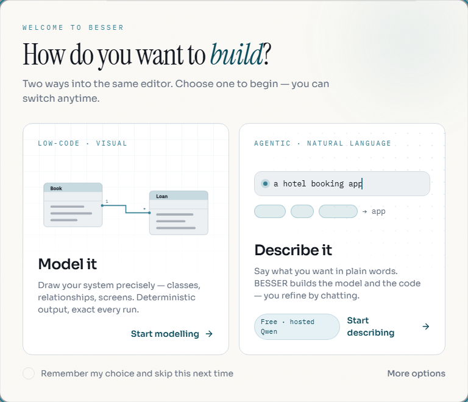
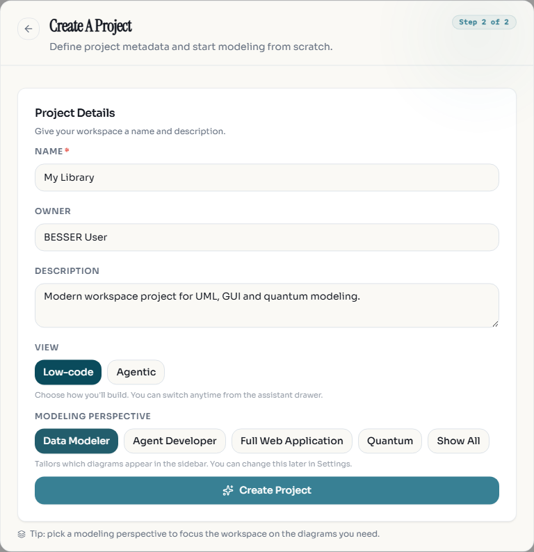

Start in the browser
====================

**Goal:** create a model and download its generated code. You only need a
browser; installation and an AI key are not required for this path.

   Choose **Model it** to start with the visual canvas.

1. Open `editor.besser-pearl.org <https://editor.besser-pearl.org>`_.
2. Choose **Model it** for the visual canvas. On later visits, use
   **File > New Project** and select **Low-code**.
3. Name your project, choose **Data Modeler**, and click **Create Project**.

   The project dialog lets you choose the name, view, and modeling perspective.

4. Add a class named ``Book`` with an attribute ``title: str``.
5. Click **Quality Check** and resolve any errors it reports.
6. Open **Generate > OOP > Python Classes**. Your download
   contains the class described by the diagram.
7. Use **File > Export Project** to save a JSON copy you can import later.

.. figure:: ../images/editor/book-properties.png
   :width: 100%
   :alt: Editor canvas showing a Book class and its title and pages attributes

   Double-click a class to edit its name and attributes in the properties panel.
   This example adds a ``pages: int`` attribute as well as ``title: str``.

.. important::

   Projects are saved in this browser's site storage. Export work you want to
   keep before clearing site data or switching browsers.

Want a complete walkthrough with two classes and an association? Follow
`Your first project <https://besser.readthedocs.io/projects/besser-web-modeling-editor/en/latest/tutorials/first-project.html>`_
in the editor guide.

Describe a system instead
-------------------------

Choose **Describe it** or the **Agentic** interface to open the assistant.
Try: *"Create a library model with books and authors. Each book has a title
and belongs to one author."* Review the diagram before requesting code.

The assistant creates and edits models. A separate :doc:`Spec-Driven Agent
run <../guides/build-with-ai>` generates and changes application files when
you explicitly ask for it.

Next steps
----------

* `Editor user guide <https://besser.readthedocs.io/projects/besser-web-modeling-editor/en/latest/>`_:
  projects, diagrams, the assistant, and exporting.
* :doc:`../guides/choose-generator`: pick an output for your model.
* :doc:`../guides/build-with-ai`: generate an application from a description.
