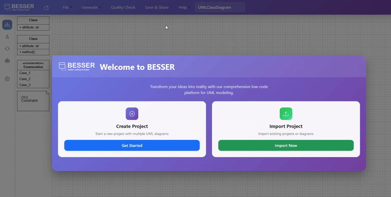

Web Modeling Editor
===================

One of the practical ways to use BESSER is through the Web Modeling Editor, where you can rapidly 
design :doc:`B-UML <../buml_language>` models and use the :doc:`BESSER code generators <../generators>`.

.. note::
   The BESSER Web Editor is now live and available at `editor.besser-pearl.org <https://editor.besser-pearl.org>`_. You can access and use it directly in your browser without installing anything locally.

Below, you will find guides on the basics of using the editor and deploying it locally on your machine.
The editor's source code is available in the `BESSER_WME GitHub repository <https://github.com/BESSER-PEARL/BESSER_WME_standalone>`_,
where you can find additional information on its usage, configuration, and the technologies used in its development.

.. toctree::
   :maxdepth: 2
   
   web_modeling_editor/use_the_wme
   web_modeling_editor/project
   web_modeling_editor/diagram_types
   web_modeling_editor/deploy_locally

.. note::
   The BESSER Web Editor is based on a fork of the `Apollon project <https://apollon-library.readthedocs.io/en/latest/>`_, a UML modeling editor.