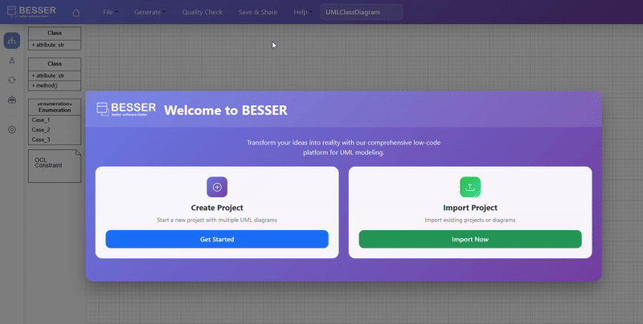

Web Modeling Editor
===================

One of the practical ways to use BESSER is through the Web Modeling Editor, where you can rapidly 
design :doc:`B-UML <../buml_language>` models and use the :doc:`BESSER code generators <../generators>`.

.. note::
   The BESSER Web Modeling Editor is now live and available at
   `editor.besser-pearl.org <https://editor.besser-pearl.org>`_.
   You can access and use it directly in your browser without installing anything locally.

The full Web Modeling Editor documentation is published as a separate subproject:
`BESSER Web Modeling Editor documentation <https://besser.readthedocs.io/projects/besser-web-modeling-editor/en/latest/>`_.
For contributor workflows like adding a new diagram type, see
`Adding a New Diagram Type <https://besser.readthedocs.io/projects/besser-web-modeling-editor/en/latest/contributing/new-diagram-guide/index.html>`_.

The editor's source code is available in the
`BESSER-WEB-MODELING-EDITOR GitHub repository <https://github.com/BESSER-PEARL/BESSER-WEB-MODELING-EDITOR>`_.
The frontend is vendored into this repository as a git submodule at
``besser/utilities/web_modeling_editor/frontend``, while the backend services live here under
``besser/utilities/web_modeling_editor/backend``.

Agent Personalization
---------------------

The editor exposes the full :doc:`agent personalization <generators/agent_personalization>`
workflow under the *Agent* diagram type:

- **User diagrams** (see :doc:`buml_language/model_types/user_diagram`) describe
  an end-user — age, languages, skills, education, disabilities. They can be
  created alongside the agent diagram in the same project.
- The **Agent Configuration** panel lets you edit the structured configuration
  (language, style, readability, modality, platform, LLM…) directly, or ask the
  backend for a recommendation based on one of the saved user profiles.

  - *Deterministic mapping* produces a configuration from a literature-backed
    rule table — no OpenAI key needed.
  - *LLM recommendation* calls the configured OpenAI model. An API key must be
    set either in the panel or as the ``OPENAI_API_KEY`` environment variable
    on the backend.
- When generating or deploying, three variant mechanisms can run in parallel:
  multi-language output, configuration variants, and per-profile
  **personalization mappings** that bundle one agent variant per mapped user.

The *Deploy chatbot* action reuses the same pipeline to push a standalone,
Streamlit-based agent to a GitHub repository with a ready-to-use Render
blueprint. See :doc:`web_editor_backend` for the underlying endpoints.

Backend API Reference
---------------------

The backend services that power code generation, validation, and deployment are
documented separately. If you are integrating with the backend API or extending it,
see:

.. toctree::
   :maxdepth: 1

   web_editor_backend

.. note::
   The BESSER Web Modeling Editor is based on a fork of the
   `Apollon project <https://apollon-library.readthedocs.io/en/latest/>`_, a UML modeling editor.
