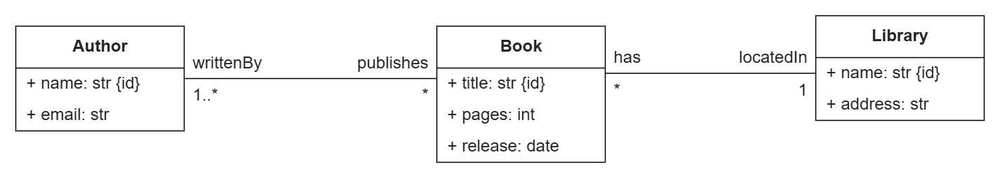
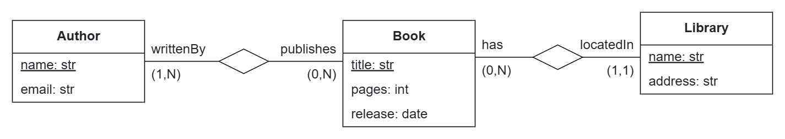

Web Modeling Editor
===================

One of the practical ways to use BESSER is through the Web Modeling Editor, where you can rapidly 
design :doc:`B-UML <../buml_language>` models and use the :doc:`BESSER code generators <../generators>`.

.. note::
   The BESSER Web Modeling Editor is now live and available at
   `editor.besser-pearl.org <https://editor.besser-pearl.org>`_.
   You can access and use it directly in your browser without installing anything locally.

The full Web Modeling Editor documentation is published as a separate subproject:
`BESSER Web Modeling Editor documentation <https://besser.readthedocs.io/projects/besser-web-modeling-editor/en/latest/>`_.
For contributor workflows like adding a new diagram type, see
`Adding a New Diagram Type <https://besser.readthedocs.io/projects/besser-web-modeling-editor/en/latest/contributing/new-diagram-guide/index.html>`_.

.. image:: ./img/besser_new.gif
   :width: 900
   :alt: BESSER Web Modeling Editor interface
   :align: center

The editor's source code is available in the
`BESSER-WEB-MODELING-EDITOR GitHub repository <https://github.com/BESSER-PEARL/BESSER-WEB-MODELING-EDITOR>`_.
The frontend is vendored into this repository as a git submodule at
``besser/utilities/web_modeling_editor/frontend``, while the backend services live here under
``besser/utilities/web_modeling_editor/backend``.

Class Diagram Notation
----------------------

Class diagrams can be rendered in two equivalent notations, chosen from
**Project Settings → Display → Class Diagram Notation**. The underlying B-UML
model is identical in both cases — the notation only affects how the diagram is
drawn, so switching is lossless.

**UML** (default) — standard UML class notation with visibility prefixes,
``{id}`` markers on identifier attributes, and ``min..max`` multiplicities.

**ER** (Chen-style) — entity/relationship flavor aimed at users with a database
modeling background. Identifier attributes (``is_id``) are underlined, the
methods compartment is hidden, associations are drawn as named diamonds, and
multiplicities are shown as ``(min,max)`` cardinality pairs (with ``*`` rendered
as ``N``). Inheritance relationships keep their UML rendering since there is no
direct ER equivalent.

Agent Personalization
---------------------

The editor exposes the full :doc:`agent personalization <generators/agent_personalization>`
workflow under the *Agent* diagram type:

- **User diagrams** (see :doc:`buml_language/model_types/user_diagram`) describe
  an end-user — age, languages, skills, education, disabilities. They can be
  created alongside the agent diagram in the same project.
- The **Agent Configuration** panel lets you edit the structured configuration
  (language, style, readability, modality, platform, LLM…) directly, or ask the
  backend for a recommendation based on one of the saved user profiles.

  - *Deterministic mapping* produces a configuration from a literature-backed
    rule table — no OpenAI key needed.
  - *LLM recommendation* calls the configured OpenAI model. An API key must be
    set either in the panel or as the ``OPENAI_API_KEY`` environment variable
    on the backend.
- When generating or deploying, three variant mechanisms can run in parallel:
  multi-language output, configuration variants, and per-profile
  **personalization mappings** that bundle one agent variant per mapped user.

The *Deploy chatbot* action reuses the same pipeline to push a standalone,
Streamlit-based agent to a GitHub repository with a ready-to-use Render
blueprint. See :doc:`web_editor_backend` for the underlying endpoints.

Neural Network Diagram
----------------------

The editor supports neural network architecture modeling through the *NN*
diagram type. The underlying B-UML model captures layers, tensor operations,
and training metadata in a form that the code generators use to produce
runnable training code.

- **Layers** cover the standard catalog (Conv1D/2D/3D, Pooling,
  SimpleRNN/LSTM/GRU, Linear, Flatten, Embedding, Dropout, LayerNorm,
  BatchNorm). Each layer carries the parameters needed to define it, such
  as ``kernel_dim``, ``hidden_size`` or ``return_type``.
- **Tensor operations** (``concatenate``, ``multiply``, ``matmultiply``,
  ``reshape``, ``transpose``, ``permute``) compose layer outputs and are
  placed inline with layers in the same container.
- **NNContainer** holds the modules of a neural network. A diagram has one
  top-level container and may include additional containers used as
  sub-networks, linked into the main one via **NNReference** elements.
- **NNNext** relationships order modules within a container, defining the
  flow of data through the network.
- **Training Dataset** and **Test Dataset** elements describe the data
  feeding into the model: name, path, task type
  (``binary``/``multi_class``/``regression``), and input format
  (``csv``/``images``). When the input format is ``images``, an **Image**
  element is attached to the dataset, holding the shape and an optional
  normalization flag.
- A **Configuration** element captures training hyperparameters: batch size,
  epochs, learning rate, optimizer, loss function, metrics, plus optional
  weight decay and momentum.

The *Generate* menu offers four output variants: **PyTorch** or
**TensorFlow**, each in **Subclassing** or **Sequential** form. Diagrams are
checked against a set of metamodel rules (cross-reference integrity,
identifier safety, numerical bounds, dataset consistency) and the
**Validate** action surfaces any violations before code is generated. See
:doc:`buml_language/model_types/nn` for the metamodel reference and
:doc:`generators/pytorch` / :doc:`generators/tensorflow` for the generator
details.

Backend API Reference
---------------------

The backend services that power code generation, validation, and deployment are
documented separately. If you are integrating with the backend API or extending it,
see:

.. toctree::
   :maxdepth: 1

   web_editor_backend

.. note::
   The BESSER Web Modeling Editor is based on a fork of the
   `Apollon project <https://apollon-library.readthedocs.io/en/latest/>`_, a UML modeling editor.
