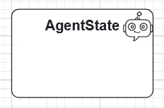
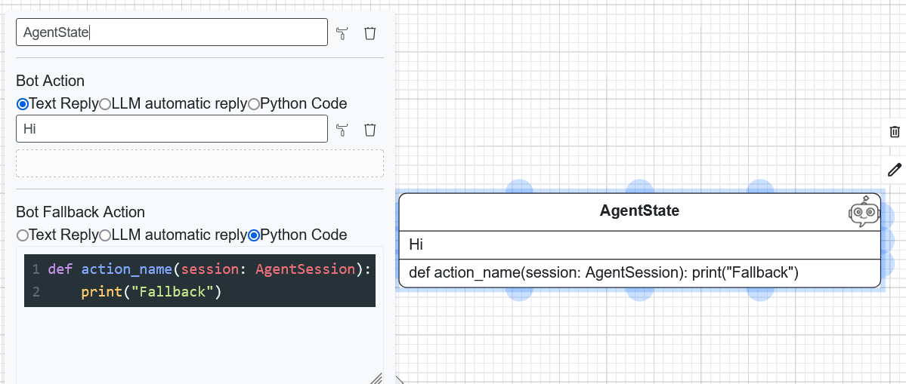
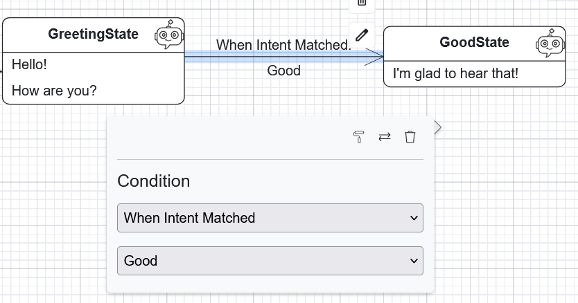
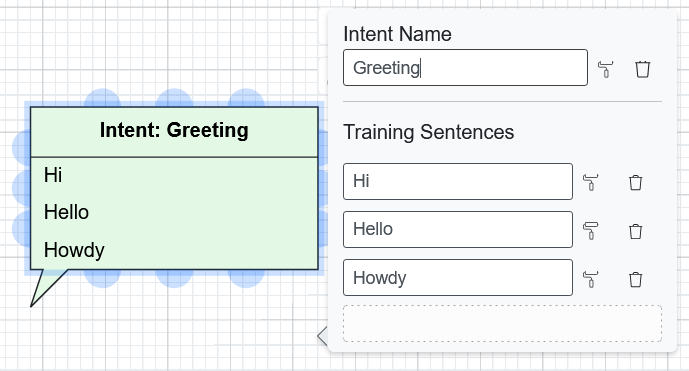
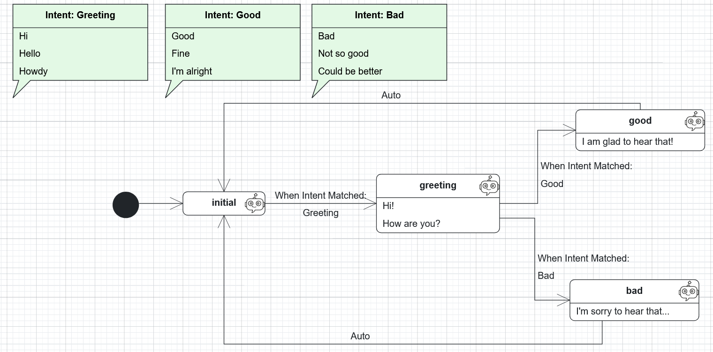
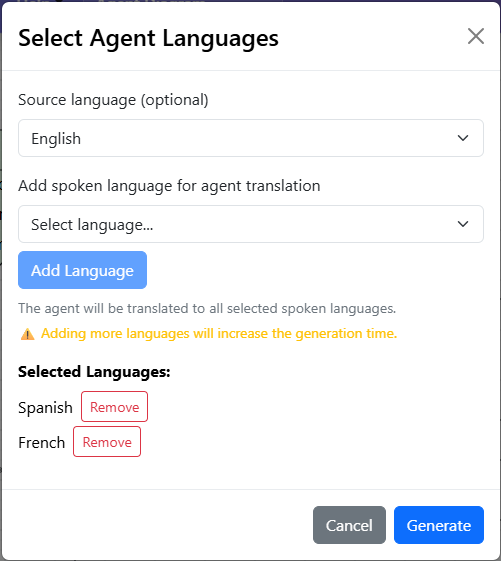

Agent Models
==============

The WME supports the definition of :doc:`agent models <./../../buml_language/model_types/agent>` via agent diagrams, which are used to represent agents and their behaviors.

We will briefly explain the main elements of an agent diagram, and then provide an example of how to create an agent model using the WME.

AgentStates
~~~~~~~~~~~~
AgentStates represent the different conditions or statuses that an agent can be in at any given time. In the WME, you can create an AgentState by dragging the "AgentState" element from the palette onto the canvas.

You will have the possibility to edit the name of the AgentState, and both the action and the fallback action that will be executed when the agent enters this state. 

You have 3 options for the body of the AgentState:
- **Text Reply**: The defined text will be sent as a reply when the agent enters this state.
- **LLM Reply**: The agent will use a Large Language Model (LLM) to generate a reply based on the user's message.
- **Python Code**: The agent performs a custom action by executing the defined Python code. Note that the function must take the session as an argument, and it can be used to access the user message and other variable (as documented in the BESSER Agentic Framework).

Transitions
~~~~~~~~~~~

You can define transitions between AgentStates by connecting them with arrows. 
When you create a transition, you can specify the condition that must be met for the transition to occur, currently we support:

- **When Intent Matched**: This transition occurs when a specific intent is matched. You can select the intent from the list of defined intents in your diagram.
- **When No Intent Matched**: This transition occurs when no intent is matched. It can be used to handle cases where the user's input does not match any predefined intent.
- **Variable Operation Matched**: This transition occurs when the defined condition hold, in which a user session variable is compared to a defined value. 
- **File Received**: This transition occurs when a file is received from the user. You need to specify the file type you expect.
- **Auto Transition**: This transition occurs automatically. 

Intents
~~~~~~~

Intents represent the vocabulary the user can use to interact with the agent. Specifically, each intent will need a name and a list of training sentences. 

Example Diagram
---------------

Here is an example of a simple agent diagram that represents the `Greetings Agent <https://besser-agentic-framework.readthedocs.io/latest/your_first_agent.html#the-greetings-agent>`_. 

Generating the Agent
--------------------

Once you have created your agent diagram, you can generate the agent by clicking 
**Generate Code** and selecting **BESSER Agent**.

You will then be asked to provide:

- **Source language**: the language of your current model.
- **Target language**: the language in which the agent will communicate.

Supported target languages include English, German, Spanish, French, Luxembourgish, and Portuguese.

After clicking **Generate**, the system will create all the necessary files, 
which you can download. The generated files also include instructions for 
deploying the agent.
