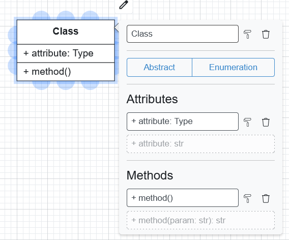
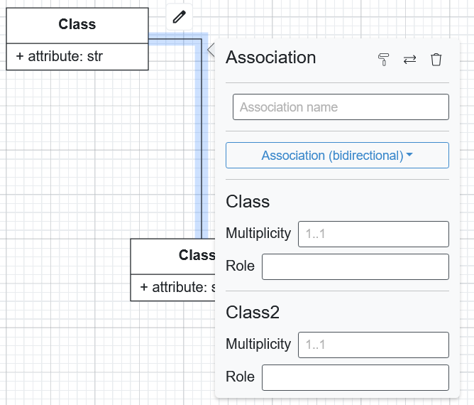
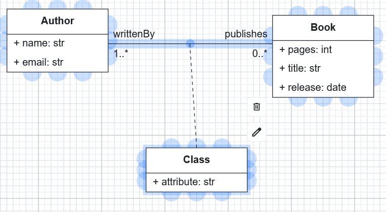

Class Diagrams
==============

Class diagrams provide a visual representation of the :doc:`structural model <../../buml_language/model_types/structural>`
in BESSER. This diagram shows the static structure of a system by displaying classes, their attributes, methods,
and the relationships between them.

Pallete
-------

The palette on the left side of the editor contains various shapes and elements you can use to create your class diagram.
These include **Classes** (with or without methods), **Enumerations**, and **OCL Constraint**. But other elements can be added
as well, from the canvas itself, such as **Associations**, **Generalizations**, and **Association Classes**.

Getting Started
---------------

Classes
~~~~~~~

To add a class to your diagram drag and drop a class element from the left panel onto the canvas.
You can open and edit the class properties by double-clicking on the class shape:



* The **Name** of the class, without spaces.
* You can also mark the class as **Abstract** or change it to define an **Enumeration**.
* The list of **Attributes**.
* The list of **Methods**.

Attribute Format
~~~~~~~~~~~~~~~~

To define attributes, you can use the following formats:

``<<visibility modifier>> <<attribute_name>> : <<data_type>>``

**Visibility Modifiers:**
Visibility modifier is public as default, but you can specify it using the following symbols:

* ``+`` Public (default)
* ``-`` Private
* ``#`` Protected

**Supported Data Types:**
The data types you can use for attributes include: ``int``, ``float``, ``str`` (default), ``bool``, ``time``,
``date``, ``datetime``, ``timedelta``, ``any``. As data type of an attribute, it's also possibility to use the
name of an Enumeration defined in the diagram.

**Attribute examples:**

* ``+ age: int`` - Public attribute of type integer
* ``address`` - Public attribute of type string
* ``state: StateList`` - Public attribute of type StateList (an Enumeration defined in the diagram)

Method Format
~~~~~~~~~~~~~

Methods can be defined with parameters and return types as follows:

``<<visibility modifier>> <<method_name>>(<<parameter_name>>: <<data_type>>): <<return_type>>``

Some examples of method definitions:

* ``+ notify(sms: str = 'message')`` - Public method that takes a parameter ``sms`` with a default value of ``message``.
* ``- findBook(title: str): Book`` - Private method that takes a ``title`` parameter of type ``str`` and returns a ``Book`` object.
* ``validate()`` - Public method without parameters.

Associations and Generalizations
~~~~~~~~~~~~~~~~~~~~~~~~~~~~~~~~

To create relationships between classes, click the source class, then click and drag from a blue connection point to the target class.
Then, you can double-click the relationship line to open the editing popup.



* **Name**: Assign a name to the association
* **Association Type**: Unidirectional, Bidirectional, Composition, or Generalization
* **End Names**: Set source and target end names
* **Multiplicity**: Modify multiplicity at both ends

**Multiplicity Format:**

Define multiplicity using standard UML notation:

* ``1`` - Exactly one
* ``0..1`` - Zero or one
* ``*`` - Zero or many
* ``1..*`` - One or many
* ``2..4`` - Between 2 and 4


OCL Constraints
~~~~~~~~~~~~~~~

You can add Object Constraint Language (OCL) constraints to your model by dragging the OCL shape onto the canvas,
writing constraints in the format ``Context "class_name" ...``, linking them to classes with dotted lines, and using
the Quality Check button to validate the syntax.

**Example OCL Constraint:**
```
Context "Person"
inv: self.age >= 0 and self.age <= 120
```

Association Classes
~~~~~~~~~~~~~~~~~~~

To create an association class, drag a Class shape onto the canvas, link it to the center point of
an existing association using a dotted line, and define its attributes like a regular class.



Code Generation
~~~~~~~~~~~~~~~

You can generate code from class diagrams in the Web Modeling editor using the following code generators:

* :doc:`Django <../../generators/django>`
* :doc:`Backend <../../generators/backend>`
* :doc:`SQL <../../generators/sql>`
* :doc:`Alchemy <../../generators/alchemy>`
* :doc:`Python <../../generators/python>`
* :doc:`Java <../../generators/java>`
* :doc:`Pydantic <../../generators/pydantic>`
* :doc:`JSON Schema <../../generators/json_schema>`
