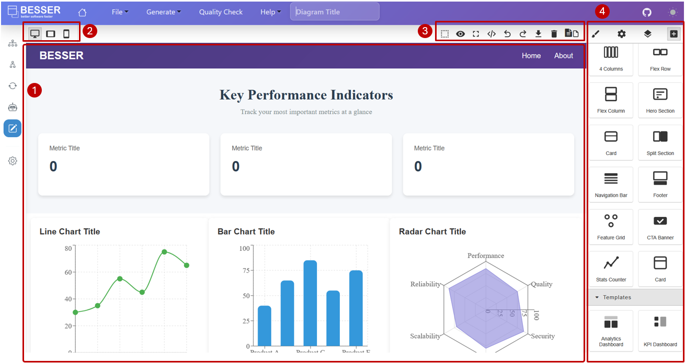
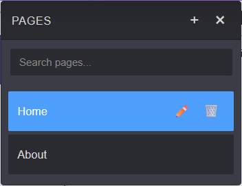

GUI modeling
============

With the BESSER Web Modeling Editor, you can visually design the graphical user interface (GUI)
for your application, no coding required. You can create and arrange pages, forms, buttons, charts,
and other interface elements using an intuitive drag-and-drop editor.

These diagrams are powered by the BESSER GUI metamodel (see :doc:`../../buml_language/model_types/gui`),
which is based on the widely-used IFML standard. This ensures your GUI designs are compatible with
your application's data model and can be easily integrated with the rest of your system.

The no-code GUI editor is composed by the following main sections:

1. Canvas
---------

The canvas is the main area where you design your GUI. You can drag components from the palette
onto the canvas to build your application's interface. Each page you create is represented
as a separate canvas area.

2. Device Preview Selector
--------------------------
The device preview selector allows you to see how your GUI will look on different devices, such as
desktop, tablet, and mobile. This helps ensure your application is responsive and provides a
consistent user experience across all platforms.

3. Editor Toolbar
-----------------
The editor toolbar provides quick access to common actions such as undo/redo, full screen mode, or
export the page in html code. You can also create/update the list of pages in your GUI diagram
from this menu. For example, clicking in Manage Pages will open the following dialog:

4. Canvas Management and Editing Panels
---------------------------------------

The top right menu contains four buttons that control access to different panels and editors within
the interface:

Open Style Manager Button
~~~~~~~~~~~~~~~~~~~~~~~~~
This menu displays general information related to the style of the element selected on the canvas.
It includes options for modifying visual properties such as colors, fonts, sizes, margins, paddings,
and other CSS attributes.

Settings Button
~~~~~~~~~~~~~~~
The settings menu displays specific information and configuration options related to the element
currently selected on the canvas. Here you can bind UI elements to entities and attributes defined
in your structural model, enabling dynamic data-driven interfaces. For example, if you select a data
table component, the settings panel will allow you to choose which entity/class from your :doc:`./class_diagram`
to display in the table.

Layer Manager Button
~~~~~~~~~~~~~~~~~~~~
The Layer Manager shows a hierarchical tree of all UI elements present on the canvas, allowing
you to organize and navigate the structure of your design.

Open Blocks Button
~~~~~~~~~~~~~~~~~~
Open Blocks opens the block palette, which contains all available UI components that can be dragged
and dropped onto the canvas. You can drag and drop elements such as:

- **Layouts**: Rows, columns, containers, and cards for structuring your pages.
- **Forms**: buttons, footers, navigation bars, and predefined dashboards.
- **Charts**: Bar, line, pie, radar, and radial bar charts for data visualization.
- **Data Tables**: Components for displaying lists of data from your domain model.

Generation a Web Application
----------------------------

Once your GUI diagram is complete, and the GUI elements correctly link entities or classes 
from your class diagram, you can generate a full-stack web application by clicking
**Generate Code** and selecting **Web App**. The code generator will produce:

- **Backend**: FastAPI application with SQLAlchemy models for your domain logic and data persistence.
- **Frontend**: React application implementing your designed GUI, with all components and data bindings.
- **Deployment**: Docker Compose and Dockerfiles for both frontend and backend, enabling rapid deployment in containers.

For more information about this code generator can be found in the :doc:`code generation documentation <../../generators/full_web_app>`.
.. note::

   The generated backend uses SQLite by default for simplicity, but can be adapted to other databases. All necessary configuration files are included for further development.
