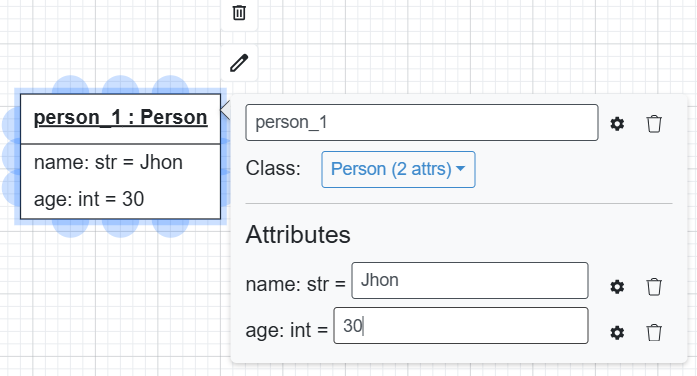
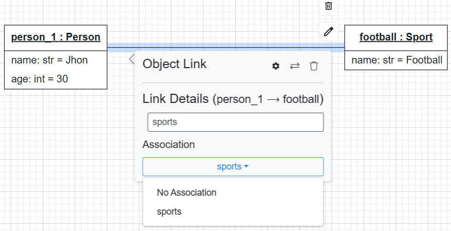

Object Diagrams
===============

Object diagrams provide a visual representation of object instances based on the class diagrams in BESSER.
They show how specific objects interact, their attribute values, and how associations between them are instantiated.

Palette
-------

The palette on the left side of the editor includes elements for creating object diagrams.
You can drag and drop **Objects** and model instance-level relationships (links). All elements are tied
to the class definitions from your class diagram (or structural model).

Getting Started
---------------

Objects
~~~~~~~

To add an object to your diagram, drag and drop an object element from the left panel onto the canvas.
Each object represents an instance of a class from your class diagram.
You can open and edit the object properties by double-clicking on the object shape:

* **Name**: Name of the object.
* **Class**: The class this object instantiates.
* **Attribute Values**: The values of the object attributes.

Object Links
~~~~~~~~~~~~

To create links between objects, click the source object, then click and drag from a blue
connection point to the target object. Object links represent instances of associations from the class diagram.

You can double-click the link to open the editing popup, where you can:

* Modify the **link name**
* Choose the **Association** this link instantiate.

OCL Constraint Validation
~~~~~~~~~~~~~~~~~~~~~~~~~

When you click the **Quality Check** button, the editor validates the object diagram against any defined
OCL constraints in the structural model:

* Evaluates OCL constraints on object instances
* Verifies invariants, pre-conditions, and post-conditions
* Displays detailed error messages for constraint violations

This is powered by `B-OCL <https://b-ocl-interpreter.readthedocs.io/en/latest/>`_, BESSER’s OCL interpreter.

Code Generation
---------------

Object diagrams are not used directly for code generation, but they complement the class diagram by validating that the model behaves correctly with real data.
