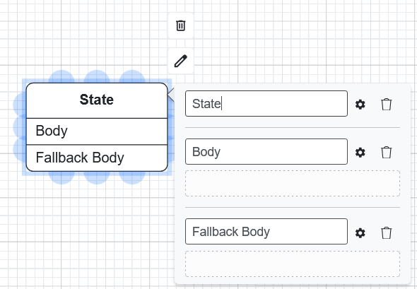
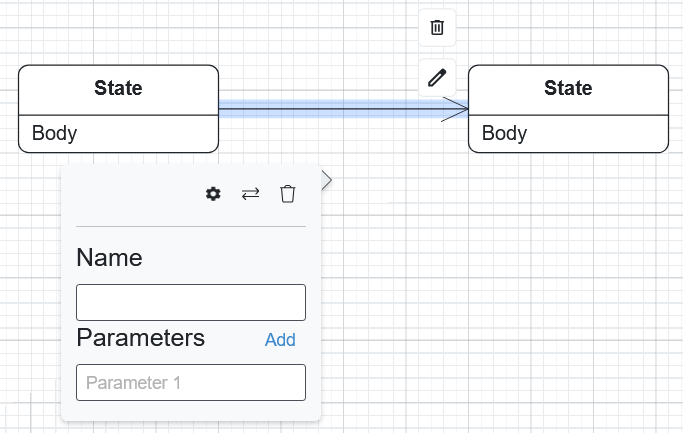

State Machine Diagrams
=======================

State machine diagrams model the dynamic behavior of a system by showing how objects change
state in response to events. They are particularly useful for modeling reactive systems, user
interfaces, and protocol specifications.

Palette
-------

The palette on the left side of the editor contains elements for creating your state machine diagram.
These include **Initial States**, **States**, **Final States**, **Transitions**, and **Code Blocks**
which can be added to the canvas to model dynamic behavior.

Getting Started
---------------

States
~~~~~~

To add regular states to your diagram, drag and drop the **state** element from the left panel.
Each state represents a condition or situation an object can be in.

You can open and edit a state’s properties by double-clicking on the shape:

* **Name**: The name for the state.
* **Body**: This is where you define the behavior of the state.
* **Fallback Action**: An optional action that executes if the state is entered without a specific trigger.

Transitions
~~~~~~~~~~~

To create a transition between states, click on the source state, drag from one of its blue connection
points to the target state, and a transition arrow will be created.

Double-click on the transition to edit its properties (**Name** and **Parameters**):

