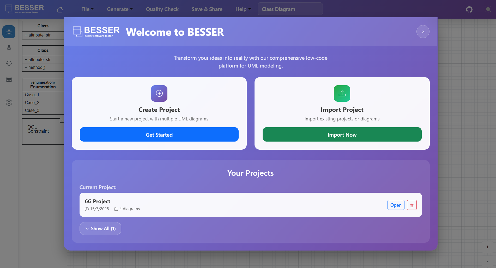
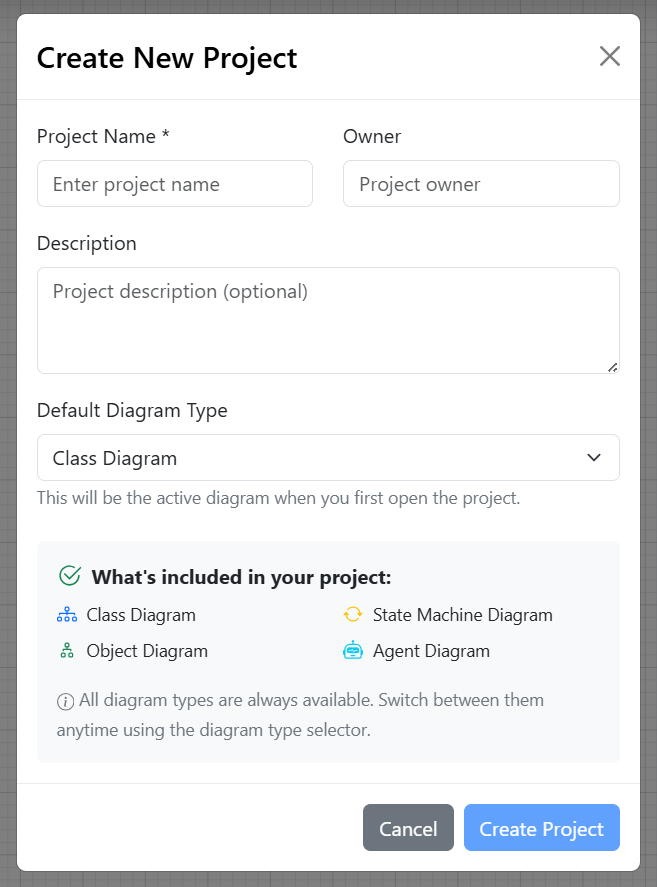
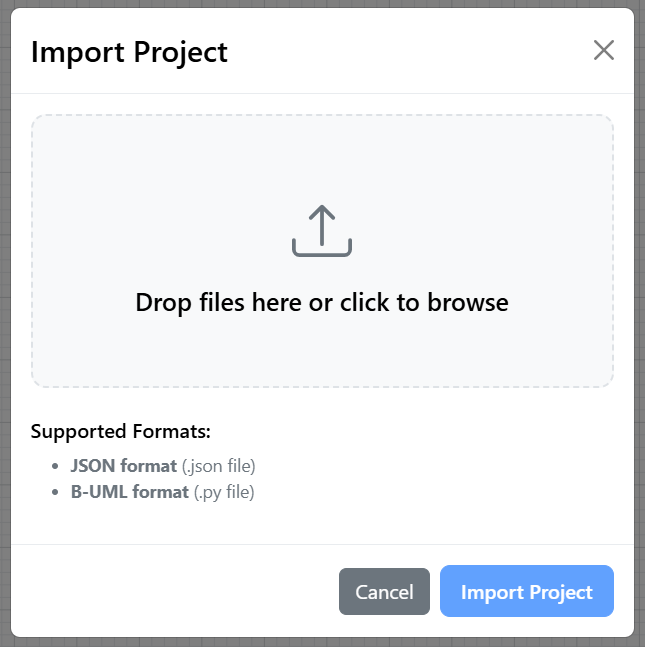
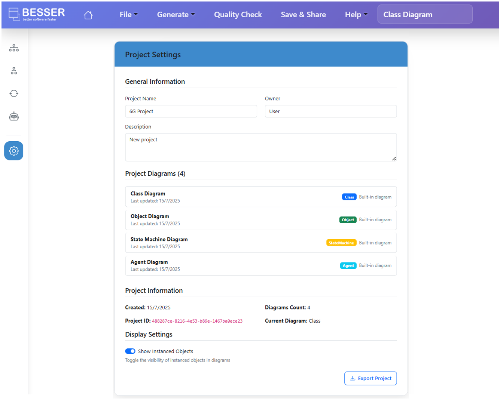
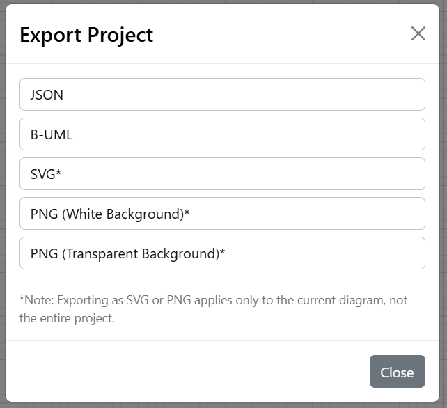

Project Management
==================

The Web Modeling Editor provides a user-friendly interface for managing your modeling
projects. This section outlines the key features and functionalities available in the
WME for project management.

Home Screen
-----------

Upon first accessing the WME, or when clicking the 🏠 **Home** button, you will be
taken to the welcome screen.
This screen allows you to create a new project, import an existing one, or open a
recent project, as follows.

Creating a New Project
----------------------

To create a new project, click the **New Project** button. You will be prompted to
enter a name, description, owner, and choose a default diagram type. Once completed,
click **Create Project**.

Each project can contain four types of models: class diagram, object model, state
machine diagram, and agent model (more model types will be added in the future).

Importing an Existing Project
-----------------------------

To import an existing project, click the **Import Project** button. You can either
select a file or drag and drop it into the designated area. The WME supports importing
projects in B-UML format (`.py` files), which is the standard format for BESSER projects,
as well as in JSON format (supported by the WME).

Project Settings
----------------

To access the project settings, click the ⚙️ **Settings** button in the sidebar.  
In this section, you can modify the project name, description, and owner.  
You can also view the project ID and adjust display settings.

Exporting a Project
-------------------

To export your project, click the **Export Project** button in the **File** upper menu.
You can choose to export the project in one of the following formats:

