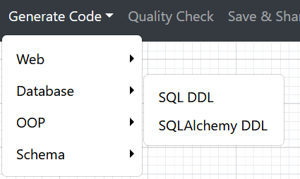
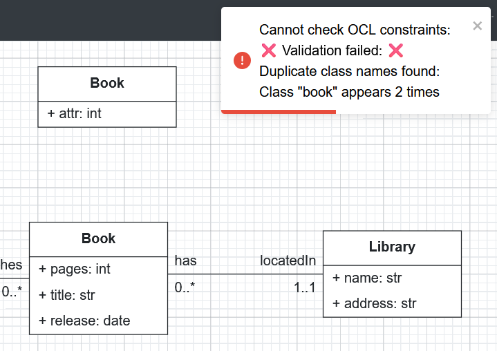

Using the Web Modeling Editor
=============================

This guide explains how to use the BESSER Web Modeling Editor.

Accessing the Editor
----------------------

You can access the BESSER Web Modeling Editor in two ways:

1. Public online version: Visit `editor.besser-pearl.org <https://editor.besser-pearl.org>`_ in your web browser
2. Local deployment: Deploy the editor locally by following the instructions in :doc:`./deploy_locally` 

Dashboard Structure
-------------------

.. image:: ../img/wme_docs.png
  :width: 800
  :alt: WME Dashboard
  :align: center

1. File Menu
~~~~~~~~~~~~

The *File* menu contains the following options:

.. image:: ../img/wme_file_menu.png
  :width: 350
  :alt: File Menu
  :align: center

- *New*: Creates a new model. Currently, :doc:`Structural models <./../buml_language/model_types/structural>` (via class diagrams) and :doc:`State Machine models <./../buml_language/model_types/state_machine>` (via state machine diagrams) are supported. Additional model types will be added in the future.
- *Start from template*: Provides ready-made examples that you can modify according to your needs.
- *Load*: Periodically, models in the WME are saved in your browser's cache memory. The *Load* option allows you to restore one of these models.
- *Import*: Imports a model in JSON or B-UML format (`.json` or `.py` file, respectively).
- *Export*: Exports your model in various formats, including B-UML, JSON, SVG, PNG, and PDF.

2. Class Diagram / State Machine Diagram
~~~~~~~~~~~~~~~~~~~~~~~~~~~~~~~~~~~~~~~~

As mentioned earlier, the WME supports :doc:`Structural models <./../buml_language/model_types/structural>` (via class diagrams) and :doc:`State Machine models <./../buml_language/model_types/state_machine>` (via state machine diagrams).
This menu allows you to switch between the two models **alternately**, while ensuring that both are saved, preventing any data loss when switching.

3. Generate Code Menu
~~~~~~~~~~~~~~~~~~~~~

Once your model is complete, you can use the :doc:`BESSER code generators <../../generators>`.
The generated code will be downloaded to your machine.

4. Quality Check
~~~~~~~~~~~~~~~~

Quality check allows you to verify whether your model contains errors, including the syntactic correctness of OCL rules.
For example, if two classes have the same name, the validation will fail as follows:

5. Save & Share
~~~~~~~~~~~~~~~

The editor allows you to save your diagram for future use and collaborate in real time. Simply click the **Save & Share**
button in the top toolbar to generate a unique URL. Share this link with collaborators, and everyone can edit the diagram
simultaneously. Changes are synchronized in real time, with each user's cursor and name visible to prevent conflicts.
Diagrams created in collaboration mode are automatically stored in the database, so you can easily close and reopen the 
model later using the same link.

6. Help menu
~~~~~~~~~~~~

The Help menu provides information on how to use the editor, details about the BESSER project, and a link to report any
issues related to the tool.

7. Palette
~~~~~~~~~~

This palette contains the shapes you can drag and drop in to the canvas. You can go to the **Help menu** for instructions
on how to use the elements of each model.

8. Canvas
~~~~~~~~~

Finally, the canvas is the drawing area where you can desing your model.
