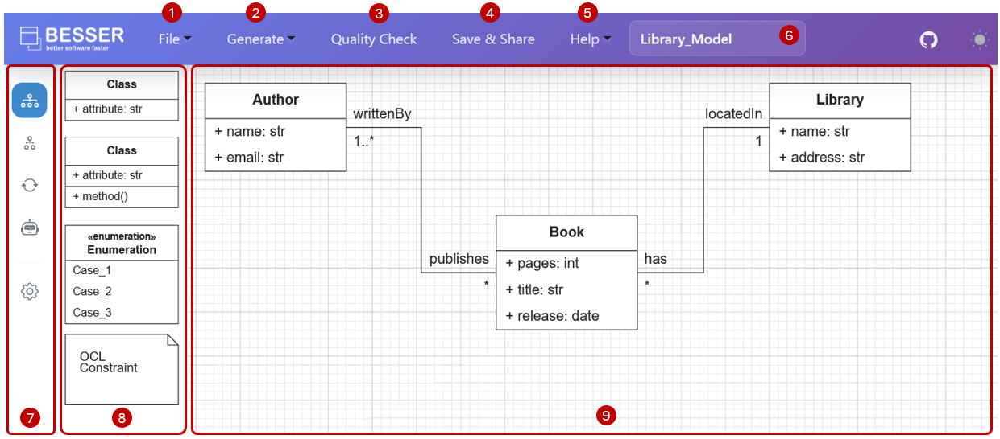
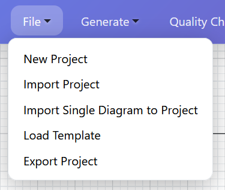
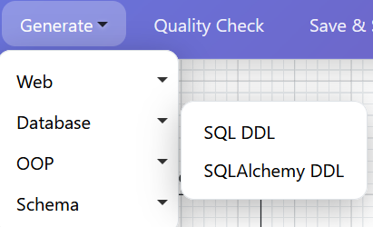
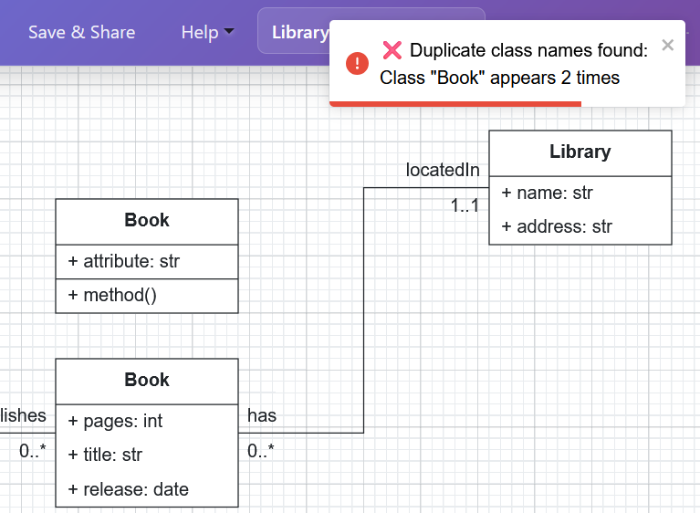

Using the Web Modeling Editor
=============================

This guide explains how to use the BESSER Web Modeling Editor.

Accessing the Editor
----------------------

You can access the BESSER Web Modeling Editor in two ways:

1. Public online version: Visit `editor.besser-pearl.org <https://editor.besser-pearl.org>`_ in your web browser
2. Local deployment: Deploy the editor locally by following the instructions in :doc:`./deploy_locally` 

Dashboard Structure
-------------------

.. note::
   The BESSER Web Modeling Editor is now organized around **projects**. Projects allow you to group related diagrams together, manage multiple models within a single workspace, and maintain better organization of your work. When you create diagrams, they are automatically organized within projects, enabling you to work on complex systems that require multiple interconnected models.

1. File Menu
~~~~~~~~~~~~

The *File* menu contains the following options:

- *New Project*: Creates a new project that can contain multiple related diagrams. Currently, :doc:`Structural models <./../buml_language/model_types/structural>` (via class diagrams), :doc:`Object models <./../buml_language/model_types/object>` (via object diagrams), :doc:`State Machine models <./../buml_language/model_types/state_machine>` (via state machine diagrams), and :doc:`Agent models <./../buml_language/model_types/agent>` (via agent diagrams) are supported. Additional model types will be added in the future.
- *Import Project*: Loads existing projects or provides ready-made example projects that you can modify according to your needs.
- *Import Single Diagram to Project*: Allows you to import individual diagrams into your current project. This is useful when you want to add specific diagrams from other sources or restore previously saved diagrams.
- *Load Template*: Imports a model template in JSON or B-UML format (`.json` or `.py` file, respectively) to start your project with predefined structures.
- *Export Project*: Exports your entire project or individual diagrams in various formats, including B-UML, JSON, SVG, PNG, and PDF.

2. Generate Code Menu
~~~~~~~~~~~~~~~~~~~~~

Once your model is complete, you can use the :doc:`BESSER code generators <../../generators>`.
The generated code will be downloaded to your machine.

3. Quality Check
~~~~~~~~~~~~~~~~

Quality check allows you to verify whether your model contains errors, including the syntactic correctness of OCL rules.
For example, if two classes have the same name, the validation will fail as follows:

4. Save & Share
~~~~~~~~~~~~~~~

The editor allows you to save your diagram for future use and collaborate in real time. Simply click the **Save & Share**
button in the top toolbar to generate a unique URL. Share this link with collaborators, and everyone can edit the diagram
simultaneously. Changes are synchronized in real time, with each user's cursor and name visible to prevent conflicts.
Diagrams created in collaboration mode are automatically stored in the database, so you can easily close and reopen the 
model later using the same link.

5. Help menu
~~~~~~~~~~~~

The Help menu provides information on how to use the editor, details about the BESSER project, and a link to report any
issues related to the tool.

6. Title of the diagram
~~~~~~~~~~~~~~~~~~~~~~~~
This is the title of the diagram you are currently working on. You can change it by clicking on the title and editing it directly.

7. Class Diagram / Object Diagram / State Machine Diagram / Agent Diagram and Project settings
~~~~~~~~~~~~~~~~~~~~~~~~~~~~~~~~~~~~~~~~~~~~~~~~~~~~~~~~~~~~~~~~~~~~~~~~~~~~~~~~~~~~~~~~~~~~~~~~~~~~~~~~~~~~

As mentioned earlier, the WME supports :doc:`Structural models <./../buml_language/model_types/structural>` (via class diagrams), :doc:`Object models <./../buml_language/model_types/object>` (via object diagrams), :doc:`State Machine models <./../buml_language/model_types/state_machine>` (via state machine diagrams), and :doc:`Agent models <./../buml_language/model_types/agent>` (via agent diagrams).
This menu allows you to switch between these models **alternately**, while ensuring that all are saved, preventing any data loss when switching.
The menu also allows you to access the project settings, where you can edit the project name, description, and other metadata.

8. Palette
~~~~~~~~~~

This palette contains the shapes you can drag and drop in to the canvas. You can go to the **Help menu** for instructions
on how to use the elements of each model.

9. Canvas
~~~~~~~~~

Finally, the canvas is the drawing area where you can design your model.
